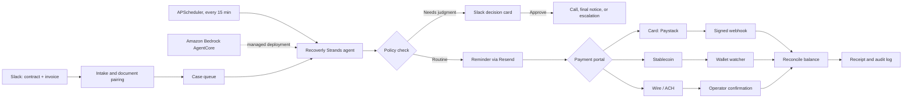

# Recoverly

Recoverly is a Strands agent that collects overdue B2B invoices for Kenyan coffee and tea exporters. It runs in the background, sends routine reminders on its own, tracks payments, and asks an operator in Slack only when a decision needs human judgment.

Built for the [Agents for Humans Hackathon](https://agentsforhumans.devpost.com/) — **Professional Agents** track.

## The problem

Exporters sell on credit to overseas buyers and spend hours chasing late invoices: checking due dates, writing follow-ups, calling buyers, and matching payments. Recoverly does that work and leaves people with only the decisions that matter.

## How it works

1. **Intake** — upload a contract and invoice to Slack. Recoverly pairs them and extracts the buyer, amount, due date, and governing law.
2. **Monitor** — every 15 minutes the Strands agent checks all open cases.
3. **Act** — routine reminders for invoices 7–14 days overdue are sent automatically after deterministic policy checks.
4. **Escalate** — disputes, anomalies, high balances, calls, final notices, and legal steps go to Slack as approve / revise / reject cards.
5. **Collect** — the buyer pays through a case-specific portal by card, stablecoin, wire, or ACH.
6. **Reconcile** — confirmed payments are matched to the case and the balance is updated.

## Architecture



## Services

| Service | Role |
|---|---|
| Strands Agents SDK | Agent runtime and tools |
| Amazon Bedrock AgentCore | Managed deployment of the agent |
| Slack | Intake, approvals, and receipts |
| Resend | Reminder and receipt emails |
| Twilio + Fish Audio | Approved buyer calls with generated speech |
| Paystack | Card payments |
| Stablecoin wallet | On-chain settlement |
| ngrok | Public URL for local webhooks |

## Quick start

Requires Python 3.11+.

```powershell
py -3.14 -m venv .venv
.venv/Scripts/python.exe -m pip install -r requirements.txt
Copy-Item .env.example .env
```

Fill in `.env` for the services you want to use, then:

```powershell
.venv/Scripts/python.exe -m tools.config_check
.venv/Scripts/python.exe -m src.webapp
```

The app runs at `http://127.0.0.1:8400`. For Slack, Twilio, or Paystack callbacks, expose it with ngrok.

| URL | Purpose |
|---|---|
| `/health` | Health check |
| `/console` | Case activity dashboard |
| `/pay/<case_id>` | Buyer payment portal |
| `/slack/events`, `/slack/interactivity` | Slack webhooks |
| `/webhooks/paystack` | Card payment events |
| `/webhooks/resend` | Email replies |
| `/voice-webhook/twiml`, `/voice-webhook/call-status` | Twilio webhooks |

## Payments

| Method | Confirmation | Settings |
|---|---|---|
| Card (Paystack) | Signed `charge.success` webhook | `PAYSTACK_SECRET_KEY`, `PAYSTACK_CALLBACK_URL` |
| Stablecoin | Wallet watcher matches the `recoverly:<case_id>` memo | `ONCHAIN_STABLECOIN_*` |
| Wire / ACH | Operator confirms with a bank reference | `WIRE_*` |

For stablecoin payments, run the watcher in a second terminal:

```powershell
.venv/Scripts/python.exe -m src.payments.wallet_poller
```

Partial payments leave the remaining balance open.

## Slack setup

- Event URL: `https://<public-url>/slack/events` (subscribe to messages and `file_shared`)
- Interactivity URL: `https://<public-url>/slack/interactivity`
- Channel: `SLACK_CONCIERGE_CHANNEL`

## AgentCore deployment

The AgentCore project is in `RecoverlyAgent/`, with `src/agentcore_runtime.py` as the entrypoint. Set `RECOVERLY_MODEL_PROVIDER=bedrock` and `BEDROCK_MODEL_ID`, add your account to `agentcore/aws-targets.json`, then from `RecoverlyAgent/`:

```powershell
agentcore validate
agentcore deploy
```

## Tools

Run with `.venv/Scripts/python.exe -m tools.<name>`.

| Script | Purpose |
|---|---|
| `config_check` | Check environment and dependencies |
| `case_status` | Show a case and its recent events |
| `cadence_scheduler` | Post the next reminder stage to Slack |
| `invoice_calendar_tick` | Run one invoice-calendar pass |
| `tz_aware_day_calc` | Calculate overdue days in the operator's timezone |
| `simulate_email_intake` | Send a test email into intake |
| `simulate_buyer_reply` | Add a test buyer reply to a case |
| `simulate_hitl_outcomes` | Replay operator decisions |
| `simulate_payment_received` | Simulate a confirmed payment |

## Project structure

```text
src/
├── agents/         Strands agent, tools, scheduler, case state
├── concierge/      Slack intake, cards, actions, email
├── preflight/      PDF extraction, document pairing, routing
├── diplomat/       Reminder and demand-letter templates
├── investigator/   Buyer payment history
├── aaa/            Arbitration and escalation letters
├── voice/          Twilio call flow
├── payments/       Providers, watcher, reconciliation
└── local_console/  Case dashboard
tests/              Automated test suite
tools/              Local utilities
RecoverlyAgent/     AgentCore deployment
```

Case state and audit logs are stored as local JSON files in `data/`.

## Testing

```powershell
.venv/Scripts/python.exe -m pytest -q
```

External services are replaced with test doubles, so tests never send email, place calls, or move money.

## License

[MIT](LICENSE)
