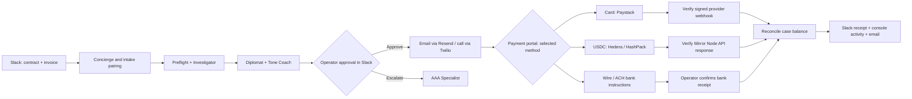

# Recoverly

Recoverly is an approval-first recovery workspace for Kenyan coffee and tea exporters managing overdue B2B invoices. It turns an invoice and contract into a structured case, prepares an appropriate collection action, keeps a human operator in control, and reconciles payments through the configured payment methods back to the case.

The primary demonstration flow is:

1. Upload a contract and invoice to the Recoverly Slack channel.
2. Pair the documents and extract the buyer, invoice, balance, due date, and governing-law context.
3. Run preflight, investigation, diplomacy, tone review, and escalation guidance.
4. Let an operator approve, revise, or reject an outbound collection action.
5. Send an approved email or place an approved call.
6. Give the buyer a case-specific payment portal offering configured card, USDC, wire, and ACH options.
7. Verify the selected method's provider response or signed webhook, or obtain operator confirmation for bank transfers, then match the payment to the case and update the balance. The USDC watcher also publishes receipts to Slack, the local console, and email.

> Recoverly is a prototype for controlled demonstrations. It is not legal advice, a production collections service, or an unattended enforcement tool. Outbound communication and payments must be configured deliberately and remain subject to operator approval.

## Judge quick start

### 1. Project overview

Recoverly helps Kenyan coffee and tea exporters recover overdue B2B invoices without losing control of customer communications. A team of focused AI roles reads uploaded contract and invoice PDFs, identifies risk and payment context, drafts a professional next step, and presents it for a human operator to approve. When a buyer pays, Recoverly checks the API response or signed webhook for the selected payment method, matches the transaction to the case, and reconciles the balance. Wire and ACH transfers use operator confirmation of receipt.

### 2. External apps and services used

Recoverly connects to more than three external applications in the working flow:

| App / service | How Recoverly uses it |
|---|---|
| Slack | Contract and invoice intake, operator approvals, recovery cards, and payment receipts |
| Payment options | Paystack card checkout, Hedera USDC transfers, and wire/ACH bank instructions; confirmation follows the selected method |
| Resend | Approved demand/reminder email delivery and settlement notifications |
| Gmail | Inbox used in the demo to receive and review collection notices and payment receipts; email delivery uses Resend, with no direct Gmail API integration |
| Twilio | Operator-approved buyer calls and call-status updates |
| ngrok | Secure public HTTPS tunnel for local Slack and Twilio webhook demonstrations |

### 3. Setup instructions

Follow the [Quick start](#quick-start) section to install Python dependencies, create `.env`, run the configuration check, and start the Flask app. For the complete demo, start the application and configure Slack and the selected payment provider's callbacks with an ngrok HTTPS URL. If using USDC, run the wallet watcher in a separate terminal. See [Payments](#payments) for each method's setup and confirmation flow.

### 4. Reliability testing

Recoverly is tested with an isolated automated suite covering case intake, document pairing, approval actions, payment routing, payment transfer matching, reconciliation, deduplication, and notification handling. Tests replace external network calls with controlled doubles, so they do not send real emails, place calls, or move funds. Run the checks in [Testing](#testing). The recorded payment path demonstrates USDC transfer verification before settlement; it does not establish live verification of every payment option.

### 5. Demo video

[Watch the Recoverly demo on YouTube](https://www.youtube.com/watch?v=4p-7WtbMgEM)

## Features

- **Slack-first case intake** — contract and invoice uploads create and enrich a recovery case.
- **Document pairing and preflight** — reads PDFs, identifies key case facts, and routes work by balance and risk.
- **Specialized recovery roles** — Preflight, Investigator, Diplomat, Tone Coach, Voice Agent, Payment Agent, Escalator, and AAA Specialist contribute a focused step to the workflow.
- **Human-in-the-loop controls** — Slack cards provide approve, revise, reject, and escalation actions before a buyer is contacted.
- **Professional communications** — builds invoice reminders, demand-letter drafts, email messages, and call scripts.
- **Voice escalation** — uses Twilio for approved buyer calls and records the outcome in the case activity.
- **Payments** — offers configured payment methods and reconciles confirmed amounts against the case balance. Available methods are Paystack cards, Hedera USDC, wire transfers, and ACH instructions. See [Payments](#payments) for confirmation details.
- **Local operator console** — shows case activity and agent progress at `/console`.
- **Auditable local state** — keeps case state, activity, payment ledger entries, and audit events locally for the prototype.

## Architecture



## Project structure

```text
recoverly/
├── src/
│   ├── webapp.py                # Flask app and registered routes
│   ├── config.py                # Environment-driven configuration
│   ├── agents/                  # Recovery-role adapters and case state
│   ├── concierge/               # Slack intake, cards, actions, email workflow
│   ├── preflight/               # PDF extraction, document pairing, risk routing
│   ├── diplomat/                # Collection-message templates and delivery
│   ├── investigator/            # Buyer-history and payment-pattern analysis
│   ├── aaa/                     # Arbitration / escalation guidance and letters
│   ├── voice/                   # Twilio call flow, transcripts, signals
│   ├── payments/                # Payment providers, bank instructions, watcher, reconciliation
│   └── local_console/           # Browser-based case activity console
├── web/                         # Payment portal template
├── config/                      # Reference configuration such as referrals
├── data/                        # Local runtime data; ignored by Git where appropriate
├── output/                      # Generated letters and documents
├── samples/                     # Sample intake material
├── tools/                       # Local simulation and configuration commands
├── tests/                       # Local automated tests (excluded from Git)
├── .env.example                 # Safe environment-variable template
├── requirements.txt             # Python dependencies
└── README.md
```

## Technology

| Area | Technology | Purpose |
|---|---|---|
| Application | Python and Flask | Webhooks, payment portal, local console, and HTTP routes |
| Collaboration | Slack Events API, Block Kit, and interactive actions | Intake, operator approvals, and case notifications |
| AI workflow | OpenAI-compatible LLM provider | Drafting, analysis, tone review, and role-specific recommendations |
| Email | Resend; Gmail inbox in demo | Resend sends notices and receipts; Gmail displays received messages |
| Voice | Twilio | Approved buyer calls and call-status webhooks |
| Payments | Paystack cards, Hedera USDC, wire / ACH | Method-specific checkout or instructions and payment reconciliation |
| Wallet | HashPack | Demo buyer wallet used to send USDC |
| Document handling | pypdf | Contract and invoice text extraction |
| Local exposure | ngrok | Public HTTPS URLs for local webhook demonstrations |
| Storage | JSON and JSONL files | Prototype case state, audit trail, and watcher state |

## Quick start

Use Python **3.11 or newer**.

```powershell
py -3.14 -m venv .venv
.venv/Scripts/python.exe -m pip install -r requirements.txt
Copy-Item .env.example .env
```

Update `.env` with credentials for only the services you plan to demonstrate. Do not commit `.env` or private keys.

Check the configuration and start the application:

```powershell
.venv/Scripts/python.exe -m tools.config_check
.venv/Scripts/python.exe -m src.webapp
```

The local server listens on `http://127.0.0.1:8400` by default.

| URL | Purpose |
|---|---|
| `/health` | Service health check |
| `/console` | Local multi-agent case console |
| `/pay/<case_id>` | Case-specific settlement portal |
| `/webhooks/paystack` | Signed card-payment settlement events |
| `/slack/events` | Slack Events API request URL |
| `/slack/interactivity` | Slack interactive action request URL |
| `/webhooks/resend` | Resend inbound/reply webhook |
| `/voice-webhook/twiml` | Twilio voice instructions |
| `/voice-webhook/call-status` | Twilio call-status webhook |

For Slack or Twilio callbacks during a local demo, expose port 8400 through ngrok and use the resulting HTTPS URL in the provider configuration.

## Payments

The buyer opens `/pay/<case_id>` and selects a configured payment method. The saved case supplies the amount and invoice context. Confirmation depends on the selected provider; opening checkout or displaying instructions does not itself confirm payment.

### Available methods

| Method | Payment flow | Confirmation |
|---|---|---|
| Card via Paystack | Creates a checkout session and redirects the buyer to the provider | A signed `charge.success` webhook reconciles the payment to the case |
| USDC via Hedera | Provides receiving account, token, amount, and `recoverly:<case_id>` memo; buyer pays with a wallet such as HashPack | The separate wallet watcher reads Mirror Node API responses, matches the transfer, and reconciles it |
| Wire transfer | Displays configured bank details and invoice reference | Operator confirms receipt using a transaction reference |
| ACH | Uses the configured bank-instruction flow | Operator confirms receipt; no automatic bank API monitoring is implemented |

Stripe is a possible future provider extension; it is not currently implemented.

Confirmed payments reduce the outstanding balance. Partial payments leave the remaining balance open. The USDC watcher additionally posts Slack and console receipts and sends email notifications.

### Payment method configuration

Configure the variables for the methods you intend to offer:

| Method | Environment variables |
|---|---|
| Card via Paystack | `PAYSTACK_SECRET_KEY`, `PAYSTACK_CALLBACK_URL`; configure `/webhooks/paystack` for settlement events |
| USDC via Hedera | `HEDERA_NETWORK`, `HEDERA_RECEIVING_ACCOUNT_ID`, `HEDERA_USDC_TOKEN_ID`, optional `HEDERA_MIRROR_NODE`, `WALLET_POLL_INTERVAL_SEC` |
| Wire / ACH instructions | `WIRE_BENEFICIARY_NAME`, `WIRE_BANK_NAME`, `WIRE_BANK_ADDRESS`, `WIRE_SWIFT_BIC`, `WIRE_ACCOUNT_NUMBER`, `WIRE_ROUTING_CODE` |
| Shared payment links | `RECOVERLY_PAYLINK_BASE` pointing to the public application URL ending in `/pay` |

Card webhooks are served by the Flask app. For USDC, also start the watcher in a second terminal:

```powershell
.venv/Scripts/python.exe -m src.payments.wallet_poller
```

The watcher is separate from the Flask server so its polling lifecycle can be managed independently. Wire and ACH use the Slack payment-received workflow with a case ID, amount, and unique bank transaction reference.

## Slack setup

Configure a Slack app with:

- Event request URL: `https://YOUR-PUBLIC-URL/slack/events`
- Interactivity request URL: `https://YOUR-PUBLIC-URL/slack/interactivity`
- Event subscriptions for messages and `file_shared`
- Scopes required for the configured workflow, including file access and chat posting
- A channel configured through `SLACK_CONCIERGE_CHANNEL`

The operator reviews all approve/revise/reject cards in that channel. Do not enable live communication paths until Slack request signing is configured.

## Running the role adapters

The local application runs with `python -m src.webapp`. The legacy remote role adapters below require an optional agent runtime and credentials, which are not included in the default installation. These commands are reference entry points for that optional integration:

```powershell
.venv/Scripts/python.exe -m src.agents.preflight_agent
.venv/Scripts/python.exe -m src.agents.investigator_agent
.venv/Scripts/python.exe -m src.agents.diplomat_agent
.venv/Scripts/python.exe -m src.agents.tone_coach_agent
.venv/Scripts/python.exe -m src.agents.concierge_agent
.venv/Scripts/python.exe -m src.agents.payment_agent
.venv/Scripts/python.exe -m src.agents.voice_agent
.venv/Scripts/python.exe -m src.agents.escalator_agent
.venv/Scripts/python.exe -m src.agents.aaa_specialist_agent
```

## Local data model

This prototype deliberately uses files instead of a hosted database:

```text
data/
├── case_state/                 # Per-case JSON state
├── local_console/sessions.json # Console sessions and activity
├── audit_trail.jsonl           # Append-only audit events
├── wallet_poller_state.json    # Hedera watcher cursor and deduplication state
├── processed_transactions.json # Applied transaction identifiers
└── wallet_case_ledger.json     # Wallet-to-case associations
```

For production, these records should move to a transactional database such as PostgreSQL, with authenticated users, durable background jobs, encrypted secrets, and a formal audit-retention policy.

## Testing

The local verification run passed **298 tests**. Test files and verification artifacts are excluded from this repository as configured in `.gitignore`; a fresh clone does not include the test suite. The following commands require the local tests directory:

```powershell
.venv/Scripts/python.exe -m pytest -q
.venv/Scripts/ruff.exe check src tests --select E9,F63,F7,F82
.venv/Scripts/python.exe -m pip check
```

Tests use isolated temporary data and test doubles for external services. They do not send real emails, make live calls, or move funds.

## Security and operational notes

- Review all AI-generated wording and escalation actions before sending them to a buyer.

## License

No license has been selected yet. Add an open-source license before public distribution.
